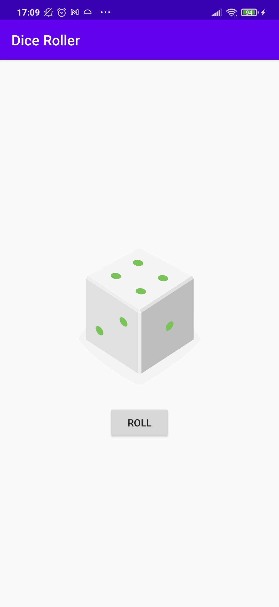

# First app

This is the toy app for lesson 1 of the [Android App Development in Kotlin course on Udacity](https://www.udacity.com/course/developing-android-apps-with-kotlin--ud9012).

## Dice Roller

This is the "Hello World" for my Android development. The app was built only to get familiarized with the concepts on XML and Kotlin for Android. It shows a button which, when pressed, randomly picks a number from 1 to 6 and shows the corresponding dice image for the user.

## Screenshots

